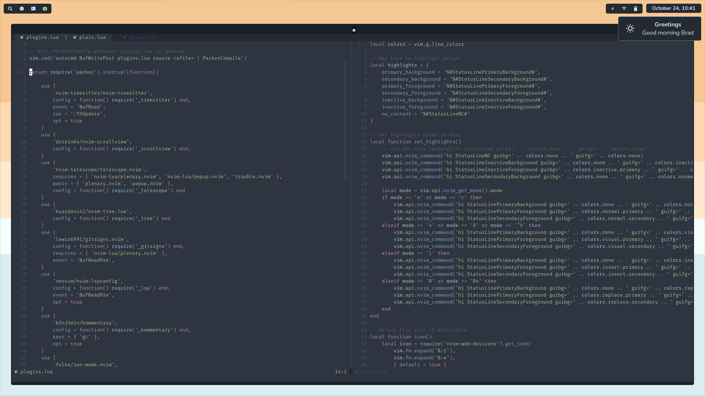

    

## Components

The core components which comprise my desktop environment.

- **OS:** [Arch](https://www.archlinux.org), [Manjaro](https://manjaro.org) and [MacOS](https://www.apple.com/macos)
- **Window manager:** [i3](https://i3wm.org/), [Awesome](https://awesomewm.org)
- **Compositor:** [Picom](https://github.com/ibhagwan/picom)
- **App launcher:** [Rofi](https://github.com/davatorium/rofi)
- **Terminal:** [Kitty](https://github.com/kovidgoyal/kitty)
- **Editor:** [Neovim](https://github.com/neovim/neovim)
- **Notifications:** [Dunst](https://github.com/dunst-project/dunst)
- **Night mode:** [Redshift](https://github.com/jonls/redshift)
- **Widgets:** [Eww](https://github.com/elkowar/eww)

## Installation

The Makefile assumes your $HOME directory is empty and may perform destructive actions. It has not yet been tested. **Use the Makefile at your own risk.**

**Mac:**

1. Install everything at once with `make mac-all` or individual components with `make mac-{xxxx}`. Refer to [Makefile](Makefile) for options.

**Arch-based distributions:**

1. Install everything at once with `make linux-all` or individual components with `make linux-{xxxx}`. Refer to [Makefile](Makefile) for options.
2. After installation, some configurations may require manual updates. Refer to the output of `make linux-manual`.

## Keybindings

| Keybinding                        | Description                                                                                      |
| --------------------------------- | ------------------------------------------------------------------------------------------------ |
| <kbd>capslock</kbd>               | Remapped to <kbd>control</kbd>                                                                   |
| <kbd>left-shift right-shift</kbd> | Both <kbd>shift</kbd> at the same time enables capslock. One <kbd>shift</kbd> disables capslock. |
| <kbd>swipe left/right</kbd>       | Cycle through virtual desktops                                                                   |

- [Awesome](.config/awesome/README.md)
- [Neovim](.config/nvim/README.md)
- [Tmux](TMUX_README.md)
- [I3](.config/i3/README.md)

## Credits

- Wallpaper sourced from [Unsplash](https://unsplash.com/photos/rekDxuJKYdI)
- Fonts sourced from [NerdFonts](https://www.nerdfonts.com)
- Glyphs sourced from [Google Fonts](https://fonts.google.com/icons)
- Icons sourced from [Papirus](https://github.com/PapirusDevelopmentTeam/papirus-icon-theme)
