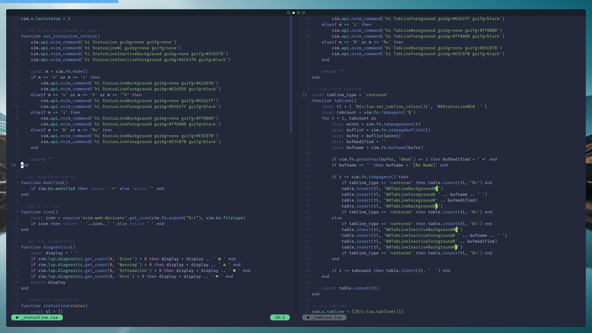
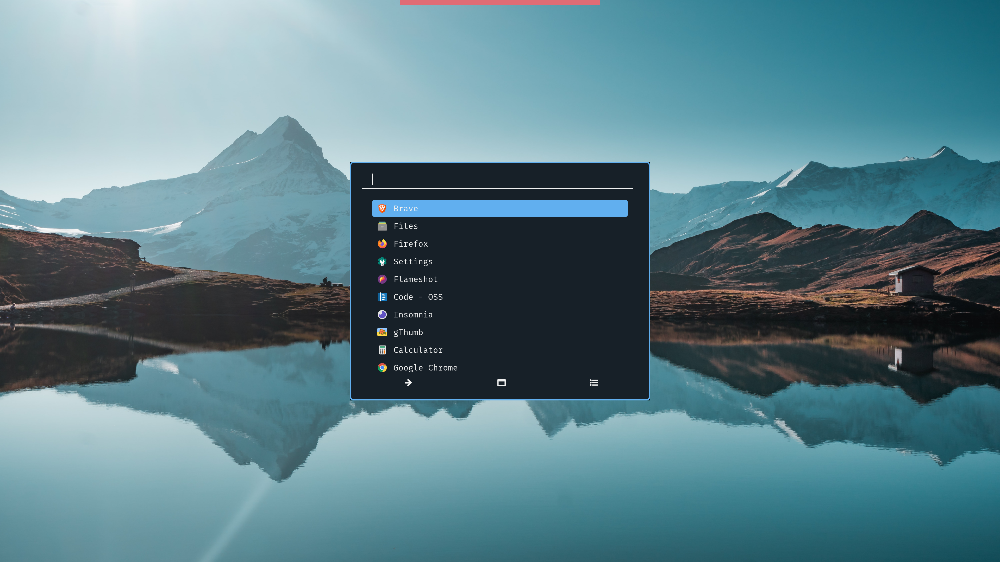

    
    
    

## Components
The core components which comprise my current desktop environment. This repository also contains dotfiles for many other applications not listed here.

* **OS:** [Arch](https://www.archlinux.org/)
* **Window manager:** [Awesome](https://awesomewm.org/)
* **Compositor:** [Picom](https://github.com/ibhagwan/picom)
* **App launcher:** [Rofi](https://github.com/davatorium/rofi)
* **Terminal:** [Kitty](https://github.com/kovidgoyal/kitty)
* **Editor:** [Neovim](https://github.com/neovim/neovim)
* **Notifications:** [Dunst](https://github.com/dunst-project/dunst)
* **Night mode:** [Redshift](https://github.com/jonls/redshift)
* **Widgets:** [Eww](https://github.com/elkowar/eww)

## Installation
The Makefile is theoretical and hasn't been tested yet. It also assumes your $HOME directory is empty and may perform destructive actions. **Use the Makefile at your own risk!**

1. Install everything at once with `make all` or individual components with `make {xxxx}`. Refer to [Makefile](Makefile) for options.
2. Some configurations may require manual updates. Refer to the *manual* section in [Makefile](Makefile) for details.
3. Restart to ensure all changes take effect.

## Keybindings
A summary of important keybindings.

* [Awesome](.config/awesome/README.md)
* [I3](.config/i3/README.md)
* [Neovim](.config/nvim/README.md)
* [Tmux](TMUX_README.md)
* Other

    | Keybinding | Description |
    | ---------- | ----------- |
    | <kbd>capslock</kbd> | Remapped to <kbd>control</kbd> |
    | <kbd>left-shift right-shift</kbd> | Both <kbd>shift</kbd> at the same time enables capslock. One <kbd>shift</kbd> disables capslock. |

## Credits

* Wallpaper sourced from [Unsplash](https://unsplash.com/photos/T_Qe4QlMIvQ)
* Fonts sourced from [NerdFonts](https://www.nerdfonts.com)
* Glyphs sourced from [Google Fonts](https://fonts.google.com/icons)
* Icons sourced from [Papirus](https://github.com/PapirusDevelopmentTeam/papirus-icon-theme)
