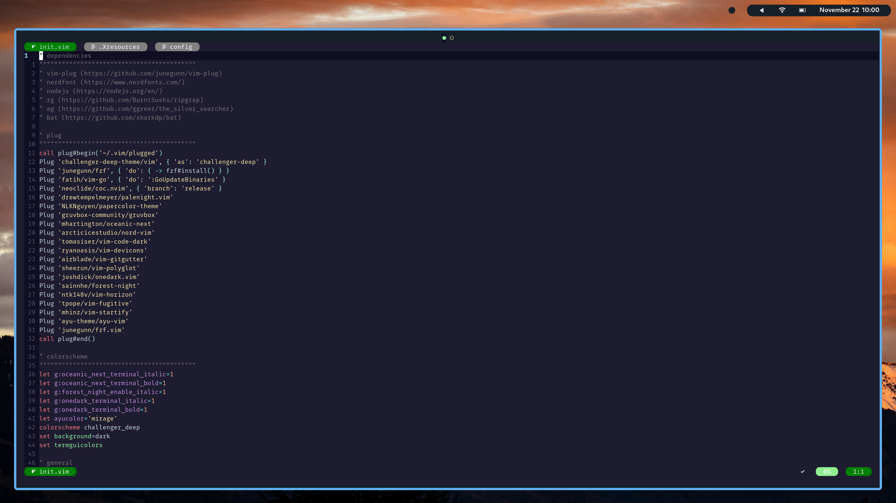

    
    
    

## Details
The core components which comprise my current desktop environment. This repository contains dotfiles for many other applications not listed here.

* **OS:** [Arch](https://www.archlinux.org/)
* **Window manager:** [Awesome](https://awesomewm.org/)
* **Compositor:** [Picom](https://github.com/ibhagwan/picom)
* **App launcher:** [Rofi](https://github.com/davatorium/rofi)
* **Terminal:** [Kitty](https://github.com/kovidgoyal/kitty) with [Challenger Deep](https://challenger-deep-theme.github.io) colors
* **Editor:** [Neovim](https://github.com/neovim/neovim) with [Challenger Deep](https://challenger-deep-theme.github.io) colors & custom statusline
* **Notifications:** [Dunst](https://github.com/dunst-project/dunst)
* **Wallpaper:** [Mountains](https://unsplash.com/photos/k6Z_CKxk1wQ)

## Installation
The Makefile is theoretical and hasn't been tested yet, so use at your own risk.

1. Install everything at once with `make all` or individual components with `make <xxxxxx>`. Refer to [Makefile](Makefile) for options.
2. Some settings are system specific and may require updating:
    * **~/.Xresources`** - _dpi_ - display scaling
    * **~/.config/i3/config** - _gaps_ - gaps size between tiled windows
    * **~/.config/i3/config** - _exec --no-startup-id feh_ - points to your wallpaper
    * **~/scripts/lock.sh** _i3lock_ - points to your lock screen wallpaper
    * **~/.config/polybar/modules/backlight.ini** - _card_ - based on output of `ls -1 /sys/class/backlight/`
    * **~/.config/polybar/modules/battery.ini** - _battery_ & _adapter_ - based on output of `ls -1 /sys/class/power_supply/`
    * **~/.config/polybar/modules/network.ini** - _interface_ - based on output of `iwctl device list`
3. Restart to ensure all changes take effect.

## Keybindings
A summary of important keybindings.

* [Awesome keybindings](.config/awesome/README.md)
* [I3 Keybindings](.config/i3/README.md)
* [Neovim Keybindings](.config/neovim/README.md)
* [Tmux](TMUX_README.md)
