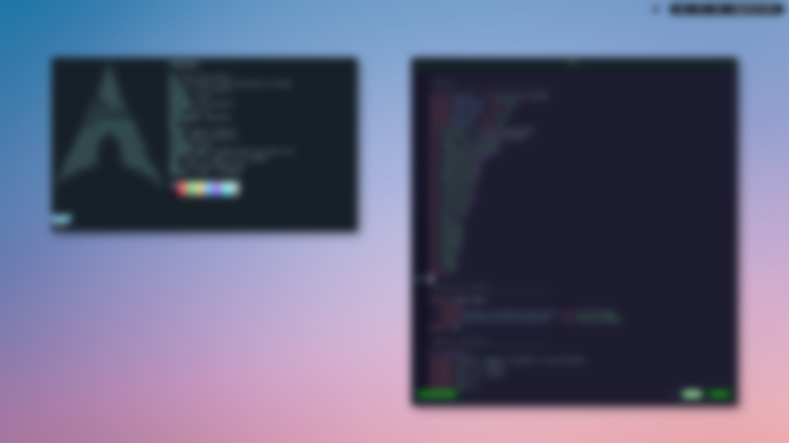

## Details
The core components which comprise the desktop environment.

* **OS:** [Arch](https://www.archlinux.org/)
* **Window manager:** [i3](https://github.com/i3/i3)
* **Compositor:** [picom](https://github.com/ibhagwan/picom)
* **Bar:** [polybar](https://github.com/polybar/polybar)
* **App launcher:** [rofi](https://github.com/davatorium/rofi)
* **Terminal:** [kitty](https://github.com/kovidgoyal/kitty) with [Challenger Deep](https://challenger-deep-theme.github.io) colors
* **Editor:** [neovim](https://github.com/neovim/neovim) with [Challenger Deep](https://challenger-deep-theme.github.io) colors & custom statusline
* **Notifications:** [dunst](https://github.com/dunst-project/dunst)
* **Wallpaper:** [Haze](https://unsplash.com/photos/GLf7bAwCdYg)

## Installation
Installation steps are written for Arch Linux. Any preexisting directories or files will be renamed with the format `name-YYYYMMDDTHHMMDD`.

1. Clone this repo with `git clone https://github.com/braddellinger/dotfiles.git`
2. Install everything at once with `make all` or individually with `make <xxxxxx>`
3. Some settings are system specific and may require updating:
    * **~/.Xresources`** - _dpi_ - display scaling
    * **~/.config/i3/config** - _gaps_ - gaps size between tiled windows
    * **~/.config/i3/config** - _exec --no-startup-id feh_ - points to your wallpaper
    * **~/.config/polybar/modules/backlight.ini** - _card_ - based on output of `ls -1 /sys/class/backlight/`
    * **~/.config/polybar/modules/battery.ini** - _battery_ & _adapter_ - based on output of `ls -1 /sys/class/power_supply/`
    * **~/.config/polybar/modules/network.ini** - _interface_ - based on output of `iwctl device list`
4. Log out and back in to ensure all changes take effect.

## Keybindings
A summary of important keybindings.

### i3
| Keybinding | Description |
| ---------- | ----------- |
| <kbd>super shift c</kbd> | Restart i3 |
| <kbd>super shift e</kbd> | Exit i3 |
| <kbd>super shift q</kbd> | Kill current window |
| <kbd>super number</kbd> | Navigate to the numbered workspace |
| <kbd>super shift number</kbd> | Move current window to the numbered workspace |
| <kbd>super space</kbd> | Display app launcher |
| <kbd>super enter</kbd> | Launch terminal |
| <kbd>super shift space</kbd> | Toggle between tiled & floating window layouts |
| <kbd>super r</kbd> and then <kbd>arrow</kbd> | Resize floating window |
| <kbd>super shift arrow</kbd> | Move floating window |
| <kbd>super f</kbd> | Toggle full screen |

### tmux
| Keybinding | Description |
| ---------- | ----------- |
| <kbd>control a</kbd> | The tmux prefix, which must be pressed & released to initiate a tmux command  |
| <kbd>control a</kbd> and then <kbd>c</kbd> | Create a new window  |
| <kbd>control a</kbd> and then <kbd>n</kbd> | Navigate to the next window  |
| <kbd>control a</kbd> and then <kbd>p</kbd> | Navigate to the previous window  |
| <kbd>control a</kbd> and then <kbd>number</kbd> | Navigate to the window corresponding to the number |
| <kbd>control a</kbd> and then <kbd>\\</kbd> | Create a new vertical pane |
| <kbd>control a</kbd> and then <kbd>_</kbd> | Create a new horizontal pane |
| <kbd>control a</kbd> and then <kbd>v</kbd> | Arrange panes vertically and evenly |
| <kbd>control a</kbd> and then <kbd>h</kbd> | Navgiate to the pane left of current pane |
| <kbd>control a</kbd> and then <kbd>j</kbd> | Navgiate to the pane below current pane |
| <kbd>control a</kbd> and then <kbd>k</kbd> | Navgiate to the pane above current pane |
| <kbd>control a</kbd> and then <kbd>l</kbd> | Navgiate to the pane right of current pane |

### neovim
| Keybinding | Description |
| ---------- | ----------- |
| <kbd>space</kbd> | The Leader, used to initiate various actions |
| <kbd>space f</kbd> | Display file fuzzy finder |
| <kbd>space b</kbd> | Display buffer fuzzy finder |
| <kbd>space r</kbd> | Display text fuzzy finder |
| <kbd>space e</kbd> | Toggle file explorer |
| <kbd>space j</kbd> | Format JSON object |

## Recommended color schemes
A collection of quality color schemes developed by others.

* [Challenger Deep](https://challenger-deep-theme.github.io)
* [One Dark](https://github.com/joshdick/onedark.vim)
* [Dracula](https://draculatheme.com/)
* [Horizon](https://github.com/ntk148v/vim-horizon)
* [Palenight](https://github.com/drewtempelmeyer/palenight.vim)
* [Oceanic Next](https://github.com/mhartington/oceanic-next)
* [Gruvbox](https://github.com/gruvbox-community/gruvbox)
* [Ayu](https://github.com/ayu-theme/ayu-vim)
* [Nord](https://www.nordtheme.com)
* [Forest Night](https://github.com/sainnhe/forest-night)

## Recommended fonts
A collection of quality fonts.

* [Inconsolata](https://www.nerdfonts.com/)
* [FiraMono](https://www.nerdfonts.com/)
* [Iosevka](https://www.nerdfonts.com/)
* [Cantarell](https://github.com/GNOME/cantarell-fonts)
